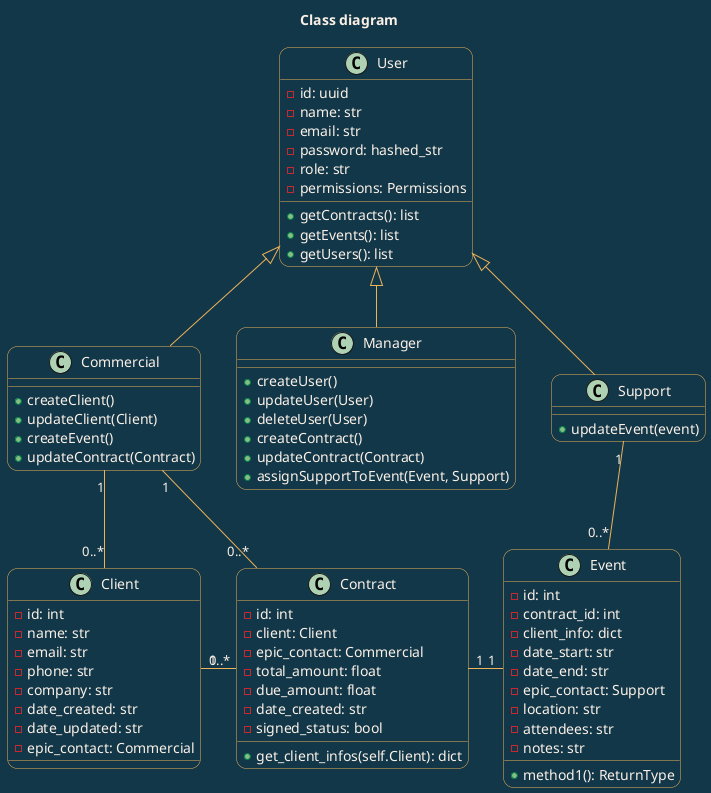
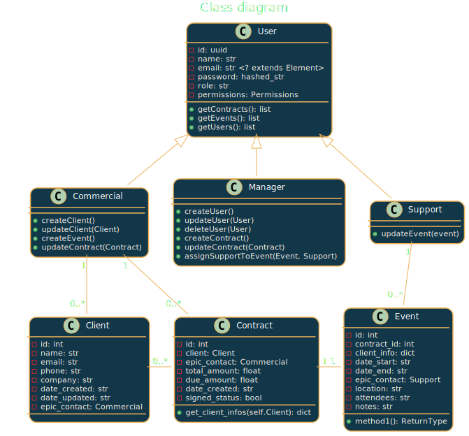
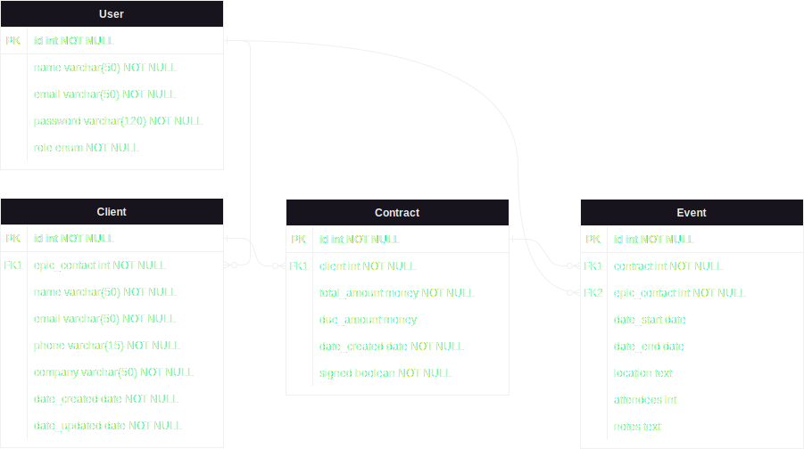

# Epic Events
Openclassrooms study project - P12

## Table of contents <!-- omit in toc -->

- [1. Todo](#1-todo)
  - [1.1. Preproject](#11-preproject)
  - [1.2. Etape 1: Env SQL/Python](#12-etape-1-env-sqlpython)
  - [1.3. Etape 2: Models/dal](#13-etape-2-modelsdal)
  - [1.4. Etape 3: User account](#14-etape-3-user-account)
  - [1.5. Etape 4: Authentification/autorisation](#15-etape-4-authentificationautorisation)
  - [1.6. Etape 5: Data reading](#16-etape-5-data-reading)
  - [1.7. Etape 6: Data creating/updating](#17-etape-6-data-creatingupdating)
  - [1.8. Etape 7: CLI Interface](#18-etape-7-cli-interface)
  - [1.9. Etape 8: Logging](#19-etape-8-logging)
  - [1.10. Etape 9: Write documentation](#110-etape-9-write-documentation)
- [2. Brief](#2-brief)
  - [2.1. Class diagram](#21-class-diagram)
  - [2.2. DB model](#22-db-model)
  - [2.3. Permissions](#23-permissions)
- [3. Upgrade suggestions](#3-upgrade-suggestions)
- [4. Documentation in progress](#4-documentation-in-progress)
  - [Installation](#installation)
  - [Configuration](#configuration)
  - [Execution](#execution)

### 1. Todo

#### 1.1. Preproject
- [x] Brief
- [x] Class diagram
- [x] Cours CRM
- [x] Cours sql

#### 1.2. Etape 1: Env SQL/Python
- [ ] Setup DB
  - [x] Formation PostgreSQL
  - [x] Formation SQLAlchemy
  - [x] Install PGadmin
  - [x] DB creation
  - [x] SQLAlchemy

#### 1.3. Etape 2: Models/dal

- [x] Setup MVC
- [x] DAO
- [ ] Secure SQL
- [ ] Add unique constraint for user name/email

#### 1.4. Etape 3: User account

- [ ] Password managing (bcrypt, argon2)
- [ ] Permissions

#### 1.5. Etape 4: Authentification/autorisation

- [ ] JWT

#### 1.6. Etape 5: Data reading

- [ ] Getters
  
#### 1.7. Etape 6: Data creating/updating

- [ ] Code DAO
- [ ] Validation by controlers
- [ ] Security
  - [ ] Injection SQL

#### 1.8. Etape 7: CLI Interface

-[ ] Choose library: click, rich

#### 1.9. Etape 8: Logging

- [ ] Sentry pour exceptions et erreurs produites
  - [ ] Caught exceptions
  - [ ] user creation/upudate
  - [ ] signing contract

#### 1.10. Etape 9: Write documentation

  - [ ] Set datatable creation script

### 2. Brief

* Départements:
  * commercial
    * Cree/update profil client
  * support
    * Responsable org evenement
  * gestion
    * Cree contrat/associe contrat-client

#### 2.1. Class diagram

<!--


-->

<!--
' MyClass "1" -- "*" MyAssociatedObject -->
#### 2.2. DB model



#### 2.3. Permissions
  
* Tous
  * Acces lecture a toutes ressources

* Gestion
  * CRUD user
  * CRU contract
  * Acces events par filtre
  * Update event (associer un user support)

* Commercial
  * creer clients
  * modifier clients propres
  * modifier contrats clients propres
  * acces contrat par filtre
  * créer evenement pour client contrat signé
  
* Support
  * acces events par filtre
  * update events propres

### 3. Upgrade suggestions

  - Add a companies table to retrieve clients from same company

### 4. Documentation in progress

#### Installation

* Clone project
  
  ```bash
  git clone https://github.com/DaGuinci/epicevents.git
  ```
  
* Install dependencies
  ```bash
  pipenv install
  ```

* Activate environment
  ```bash
  pipenv shell
  ```

#### Configuration

* Create a database and fill the config.json with correct informations:   
*To use pytest, create a second database, but this is optionnal to run the application*
  
  ```json
  {
    "db_config":{
      "db_name":"your_database",
      "db_user":"your_user",
      "db_pass":"your_pass"
    },
    "test_db_config":{
      "db_name":"your_test_database",
      "db_user":"your_user",
      "db_pass":"your_pass"
    },
  }
  ```

* After this, to prevent git to commit your local informations:
  
  ```bash
  git update-index --skip-worktree config.json
  ```
  
* To create tables it is possible to use:
  
  ```bash
  python db_tables_setup.py
  ```

  *to use a test database, change db_create.py, line 116, with*
  ```python
  credentials = config['test_db_config']
  ```

#### Execution

* Launch the application
  
    ```bash
    python main.py
    ```