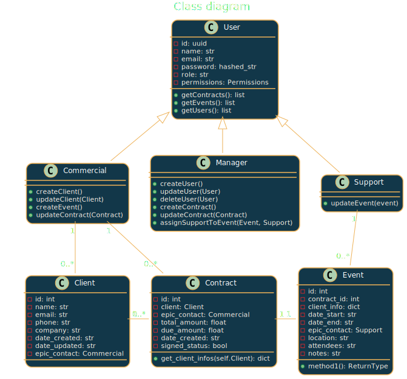
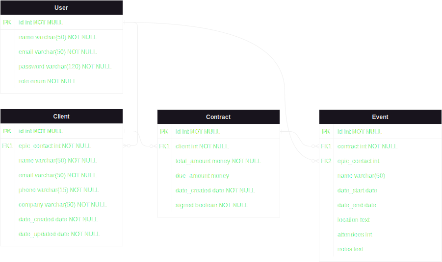

# Epic Events
Openclassrooms study project - P12

## Table of contents <!-- omit in toc -->

- [1. Brief](#1-brief)
  - [1.1. Class diagram](#11-class-diagram)
  - [1.2. DB model](#12-db-model)
  - [1.3. Permissions](#13-permissions)
- [2. Upgrade suggestions](#2-upgrade-suggestions)
- [3. Documentation](#3-documentation)
  - [Installation](#installation)
  - [Configuration](#configuration)
  - [Execution](#execution)

### 1. Brief

* Départements:
  * commercial
    * Cree/update profil client
  * support
    * Responsable org evenement
  * gestion
    * Cree contrat/associe contrat-client

#### 1.1. Class diagram

<!--


-->

<!--
' MyClass "1" -- "*" MyAssociatedObject -->
#### 1.2. DB model



#### 1.3. Permissions
  
* Tous
  * Acces lecture a toutes ressources

* Gestion
  * CRUD user
  * CRU contract
  * Acces events par filtre
  * Update event (associer un user support)
  * read all users
  * read all contracts
  * read all clients
  * read all events

* Commercial
  * creer clients
  * modifier clients propres
  * modifier contrats clients propres
  * acces contrat par filtre
  * créer evenement pour client contrat signé
  * read all users
  * read all contracts
  * read all clients
  * read all events
  
* Support
  * acces events par filtre
  * update events propres
  * read all users
  * read all contracts
  * read all clients
  * read all events

### 2. Upgrade suggestions

  - Add a companies table to retrieve clients from same company

### 3. Documentation

#### Installation

* Clone project
  
  ```bash
  git clone https://github.com/DaGuinci/epicevents.git
  ```
  
* Install dependencies
  ```bash
  pipenv install
  ```

* Activate environment
  ```bash
  pipenv shell
  ```

#### Configuration

* Create a database and fill the config.json with correct informations:   
*To use pytest, create a second database, but this is optionnal to run the application*
  
  ```json
  {
    "db_config":{
      "db_name":"your_database",
      "db_user":"your_user",
      "db_pass":"your_pass"
    },
    "test_db_config":{
      "db_name":"your_test_database",
      "db_user":"your_user",
      "db_pass":"your_pass"
    },
  }
  ```

* After this, to prevent git to commit your local informations:
  
  ```bash
  git update-index --skip-worktree config.json
  ```


#### Execution

* Launch the application
  
    ```bash
    python main.py
    ```